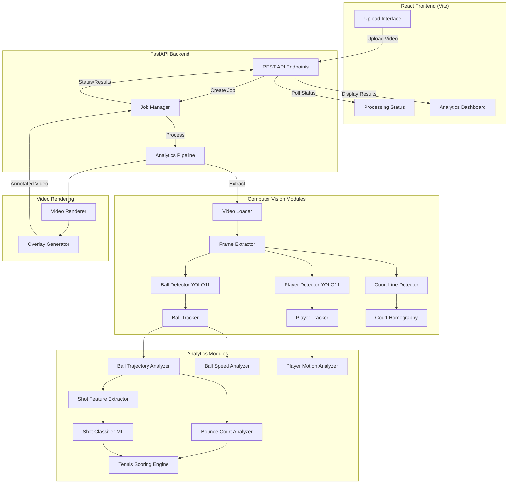

# TrackScore

**Tennis Video Analytics Platform** powered by Machine Learning and Computer Vision

TrackScore is an end-to-end system for analyzing tennis match videos, providing automated player and ball tracking, bounce detection, shot classification, and real-time scoring overlays. Built with FastAPI, React, and YOLO11, it processes uploaded videos to generate annotated match footage with comprehensive analytics.

---

## 🎯 Overview

TrackScore automates tennis match analysis by:
- Detecting and tracking players throughout the match
- Detecting and tracking the tennis ball with trajectory prediction
- Identifying court lines and establishing court geometry
- Detecting ball bounces and classifying IN/OUT calls
- Estimating ball and player speeds (court-plane approximations)
- Classifying shot types using machine learning
- Tracking live match scores (points, games, sets)
- Rendering professional video overlays with analytics

**⚠️ Limitations & Disclaimers:**
- Ball speed estimates are court-plane projections from monocular video, not true 3D velocities
- Bounce detection and IN/OUT classification depend on tracking quality and court calibration accuracy
- Shot classifier requires labeled training data; demo data is synthetic and not representative of production accuracy
- This is a portfolio/research project, **not a certified electronic line-calling system**
- Accuracy varies significantly with video quality, camera angle, and lighting conditions

---

## 🎾 Features

### Computer Vision Pipeline
- **Player Detection & Tracking**: YOLO11-based person detection with stable ID assignment
- **Ball Detection & Tracking**: High-frequency ball detection with Kalman-based trajectory prediction
- **Court Analysis**: Automated court line detection and homography calibration
- **Bounce Detection**: Trajectory analysis for bounce identification with spatial validation
- **Speed Estimation**: Frame-by-frame speed calculation for players and ball (estimated, not certified)

### Machine Learning
- **Shot Classification**: Multi-model ensemble (Random Forest, Gradient Boosting, SVM) for shot type prediction
- **Feature Extraction**: Automated extraction of temporal, spatial, and motion features from rallies
- **Training Pipeline**: Configurable training with synthetic demo datasets

### Match Analytics
- **Live Scoring**: Automatic point, game, and set tracking following tennis rules
- **Event Detection**: Rally segmentation, shot detection, bounce calls
- **Statistics**: Player distance covered, shot counts, rally lengths, IN/OUT statistics
- **Performance Metrics**: Speed profiles, court coverage analysis

### Video Rendering
- **Professional Overlays**: TrackScore branding, live scoreboard, player labels, ball markers
- **Trajectory Visualization**: 30-frame ball trajectory tail with predicted vs detected distinction
- **Event Annotations**: BOUNCE, IN, OUT, SHOT, RALLY overlays with fade effects
- **Resolution-Adaptive**: Automatic font and element scaling based on video resolution

### Web Application
- **React Frontend**: Modern SPA with video upload, real-time processing status, and analytics dashboard
- **FastAPI Backend**: Async job processing with RESTful API endpoints
- **Real-Time Progress**: WebSocket-style polling for job status and progress tracking

---

## 🏗️ System Architecture



---

## 📁 Project Structure

```
TrackScore/
├── backend/
│   └── app/
│       ├── api/              # FastAPI application
│       │   ├── routes/       # API endpoints (health, videos, analysis)
│       │   ├── main.py       # FastAPI app factory
│       │   ├── models.py     # Pydantic models
│       │   └── job_manager.py # Async job processing
│       ├── core/             # Configuration
│       │   └── config.py     # Centralized settings
│       ├── vision/           # Computer vision modules
│       │   ├── video_loader.py
│       │   ├── frame_extractor.py
│       │   ├── frame_preprocessor.py
│       │   ├── player_detector.py
│       │   ├── ball_detector.py
│       │   ├── player_tracker.py
│       │   ├── ball_tracker.py
│       │   ├── court_line_detector.py
│       │   ├── court_homography.py
│       │   ├── court_geometry.py
│       │   ├── video_pipeline.py
│       │   └── video_renderer.py
│       ├── analytics/        # Analytics modules
│       │   ├── ball_trajectory_analyzer.py
│       │   ├── bounce_court_analyzer.py
│       │   ├── ball_speed_analyzer.py
│       │   └── player_motion_analyzer.py
│       ├── ml/               # Machine learning
│       │   ├── shot_feature_extractor.py
│       │   └── shot_classifier.py
│       └── scoring/          # Tennis scoring
│           └── tennis_scoring.py
├── frontend/                 # React application
│   ├── src/
│   │   ├── components/       # React components
│   │   │   ├── Home.jsx
│   │   │   ├── UploadPage.jsx
│   │   │   ├── ProcessingPage.jsx
│   │   │   └── DashboardPage.jsx
│   │   ├── services/
│   │   │   └── api.js        # API client
│   │   ├── App.jsx
│   │   └── main.jsx
│   ├── package.json
│   └── vite.config.js
├── tests/                    # Test suite
│   ├── test_api.py           # API integration tests
│   ├── test_integration.py   # End-to-end tests
│   ├── test_*_detector.py    # Vision module tests
│   ├── test_*_analyzer.py    # Analytics tests
│   └── ...                   # 237 total tests
├── scripts/                  # Utility scripts
│   ├── smoke_test.py
│   ├── verify_setup.py
│   └── ...
├── data/                     # Training/test data
├── models/                   # ML model weights
├── uploads/                  # Uploaded videos
├── outputs/                  # Processed results
├── requirements.txt
├── .env.example
└── README.md
```

---

## 🛠️ Tech Stack

### Backend
- **FastAPI** - Modern async web framework
- **Uvicorn** - ASGI server
- **OpenCV** - Computer vision operations
- **Ultralytics YOLO11** - Object detection (players, ball)
- **NumPy** - Numerical computations
- **scikit-learn** - Machine learning (shot classification)
- **Pandas** - Data manipulation
- **PyTorch** - Deep learning backend for YOLO

### Frontend
- **React 18** - UI framework
- **Vite** - Build tool and dev server
- **Axios** - HTTP client
- **React Router** - Client-side routing

### Testing
- **pytest** - Test framework (237 tests)
- **FastAPI TestClient** - API testing

---

## 🚀 Getting Started

### Prerequisites

- **Python 3.8+**
- **Node.js 16+** and npm
- **Git**

### Installation

#### 1. Clone Repository
```bash
git clone <repository-url>
cd TrackScore
```

#### 2. Backend Setup

```bash
# Create virtual environment
python -m venv .venv

# Activate virtual environment
# Windows:
.venv\Scripts\activate
# Linux/Mac:
source .venv/bin/activate

# Install dependencies
pip install -r requirements.txt
```

#### 3. Frontend Setup

```bash
cd frontend
npm install
cd ..
```

#### 4. Environment Configuration

**Backend** - Create `.env` in project root (optional):
```bash
# Copy example
cp .env.example .env

# Edit as needed
API_HOST=0.0.0.0
API_PORT=8000
MAX_UPLOAD_SIZE=104857600  # 100MB
LOG_LEVEL=INFO
```

**Frontend** - Create `.env` in `frontend/` directory (optional):
```bash
# Copy example
cp frontend/.env.example frontend/.env

# Edit as needed
VITE_API_BASE_URL=http://localhost:8000
```

#### 5. Verify Setup

```bash
# Run smoke tests
python scripts/smoke_test.py

# Run setup verification
python scripts/verify_setup.py
```

---

## ▶️ Running the Application

### Start Backend

```bash
# Development mode with auto-reload
python -m uvicorn backend.app.api.main:app --reload

# Production mode
python -m uvicorn backend.app.api.main:app --host 0.0.0.0 --port 8000
```

Backend will be available at `http://localhost:8000`

API documentation: `http://localhost:8000/docs`

### Start Frontend

```bash
cd frontend

# Development mode
npm run dev

# Build for production
npm run build

# Preview production build
npm run preview
```

Frontend will be available at `http://localhost:5173` (dev mode)

---

## 📹 Using TrackScore

### 1. Upload Video
- Navigate to the web interface
- Click "Upload Video" 
- Select a tennis match video (MP4, MOV, or AVI)
- Maximum file size: 100MB
- Supported formats: MP4, MOV, AVI

### 2. Process Video
- Click "Start Analysis"
- Monitor real-time processing progress
- Processing stages:
  - Video metadata extraction
  - Frame extraction and preprocessing
  - Player and ball detection
  - Trajectory and bounce analysis
  - Speed estimation
  - Shot classification
  - Match scoring
  - Video rendering with overlays

### 3. View Results
- Automatic redirect to analytics dashboard
- View video information (resolution, FPS, duration)
- Review detection statistics
- See match scoreboard (if scoring data available)
- Download annotated video with overlays

---

## 🔌 API Endpoints

### Health Check
```
GET /api/health
```
Returns service status.

### Video Upload
```
POST /api/videos/upload
Content-Type: multipart/form-data

Body: file (video file)

Response: {
  "video_id": "uuid",
  "filename": "string",
  "size_bytes": number,
  "upload_path": "string"
}
```

### Start Analysis
```
POST /api/analysis/start/{video_id}
Body (optional): {
  "max_frames": number | null
}

Response: {
  "job_id": "uuid",
  "video_id": "string",
  "status": "queued"
}
```

### Check Status
```
GET /api/analysis/status/{job_id}

Response: {
  "job_id": "string",
  "video_id": "string",
  "status": "queued" | "processing" | "completed" | "failed",
  "progress_percentage": number,
  "message": "string",
  "error": "string" | null
}
```

### Get Results
```
GET /api/analysis/result/{job_id}

Response: {
  "job_id": "string",
  "video_id": "string",
  "status": "completed",
  "summary": { /* analysis summary */ },
  "warnings": ["string"]
}
```

### Get Metadata
```
GET /api/analysis/metadata/{job_id}

Response: {
  "job_id": "string",
  "video_id": "string",
  "status": "completed",
  "metadata": { /* full analytics */ },
  "warnings": ["string"]
}
```

### Download Video
```
GET /api/analysis/video/{job_id}

Response: video/mp4 file
```

---

## 🧪 Testing

### Run All Tests
```bash
pytest
```

### Run Specific Test Suite
```bash
# API tests
pytest tests/test_api.py

# Integration tests
pytest tests/test_integration.py

# Vision module tests
pytest tests/test_player_detector.py
pytest tests/test_ball_tracker.py

# Analytics tests
pytest tests/test_bounce_court_analyzer.py
pytest tests/test_ball_speed_analyzer.py

# ML tests
pytest tests/test_shot_classifier.py

# Scoring tests
pytest tests/test_tennis_scoring.py

# Renderer tests
pytest tests/test_video_renderer.py
```

### Run with Verbose Output
```bash
pytest -v
```

### Run with Coverage
```bash
pytest --cov=backend
```

### Frontend Tests
```bash
cd frontend
npm run lint
npm run build
```

**Test Coverage:**
- 237 total tests
- API integration tests (29 tests)
- End-to-end workflow tests (9 tests)
- Computer vision module tests (90+ tests)
- Analytics module tests (50+ tests)
- ML pipeline tests (15+ tests)
- Video renderer tests (22 tests)
- Scoring engine tests (18 tests)

---

## 🧠 ML Pipeline Explanation

### Shot Classification Workflow

1. **Feature Extraction**
   - Rally segmentation from ball trajectory data
   - Shot segmentation within rallies
   - Feature computation per shot:
     - Ball landing position (court coordinates)
     - Shot angle and direction
     - Ball speed at impact
     - Distance traveled
     - Time between shots
     - Trajectory curvature

2. **Training**
   - Multi-model ensemble approach:
     - Random Forest Classifier
     - Gradient Boosting Classifier
     - Support Vector Machine (SVM)
   - Majority voting for predictions
   - Cross-validation for model evaluation
   - Model serialization with joblib

3. **Prediction**
   - Load trained models from `models/shot/`
   - Extract features from new match data
   - Ensemble prediction across models
   - Shot type classification (forehand, backhand, serve, volley, etc.)

**⚠️ Training Data Notice:**
- Demo training data in `data/processed/demo_shot_dataset.csv` is **synthetic**
- Generated for demonstration purposes only
- Real-world accuracy requires labeled match footage
- Current models should not be used for production analysis

### Model Training Script
```bash
python scripts/train_shot_classifier.py
```

---

## 👁️ Computer Vision Pipeline Explanation

### 1. Video Loading & Frame Extraction
- Load video metadata (resolution, FPS, duration)
- Extract frames at configurable intervals
- Validate video codec and format

### 2. Frame Preprocessing
- Resize to YOLO input dimensions (640x640)
- Letterbox padding to maintain aspect ratio
- Brightness and quality validation
- Normalization for model input

### 3. Player Detection & Tracking
- **Detection**: YOLO11 person detection on each frame
- **Filtering**: Score-based filtering and court-region validation
- **Tracking**: Stable ID assignment using spatial proximity
- **Smoothing**: Position smoothing across frames

### 4. Ball Detection & Tracking
- **Detection**: YOLO11 sports ball detection
- **Validation**: Color-based validation (yellow tennis ball)
- **Tracking**: Kalman filter for trajectory prediction
- **Gap Filling**: Predicted positions during occlusion/miss

### 5. Court Analysis
- **Line Detection**: Canny edge detection + Hough line transform
- **Classification**: Horizontal/vertical line identification
- **Homography**: 2D perspective transform calibration
- **Geometry**: Real-world court coordinate mapping

### 6. Bounce Detection
- **Trajectory Analysis**: Vertical velocity reversal detection
- **Spatial Validation**: Bounce position mapped to court coordinates
- **IN/OUT Classification**: Boundary distance comparison with tolerance
- **Confidence Scoring**: Based on tracking quality and geometry

### 7. Speed Estimation
- **Court-Plane Speed**: 2D distance / time calculations
- **Calibration Required**: Uses homography for pixel-to-meter conversion
- **Limitations**: 
  - Not true 3D speed (only court-plane projection)
  - Accuracy depends on camera angle and calibration
  - Movement perpendicular to court plane is not captured

### 8. Video Rendering
- **Frame-by-frame Processing**: Read source video frames
- **Overlay Generation**: 
  - TrackScore branding with timestamp
  - Live scoreboard (Player A/B, points/games/sets)
  - Player bounding boxes and speed
  - Ball markers (green=detected, orange=predicted)
  - Ball trajectory tail (30 frames)
  - Event overlays (BOUNCE, IN, OUT, SHOT, RALLY)
- **Encoding**: MP4 output with mp4v codec

---

## ⚠️ Limitations

### Technical Constraints
1. **Monocular Video**: Single-camera footage limits 3D reconstruction accuracy
2. **Speed Estimation**: Court-plane projections only; not true 3D velocities
3. **Calibration Dependency**: Accuracy requires good court line visibility and successful homography
4. **Lighting Conditions**: Performance degrades in poor lighting or shadows
5. **Camera Angle**: Best results with elevated, centered camera positions
6. **Occlusion Handling**: Ball tracking fails during heavy occlusion periods

### Model Limitations
1. **YOLO Detection**: Dependent on model training data; may miss small/distant balls
2. **Shot Classification**: Requires labeled training data; demo models are not production-ready
3. **Scoring Accuracy**: Assumes perfect rally detection; may miss or miscount points
4. **Bounce Detection**: Sensitive to frame rate and tracking quality

### System Limitations
1. **Processing Time**: Real-time processing not supported; batch processing only
2. **File Size**: 100MB upload limit (configurable)
3. **Memory Usage**: Full video loaded into memory during processing
4. **No GPU Acceleration**: CPU-only processing (GPU support possible with PyTorch CUDA)

---

## 🔮 Future Improvements

### Computer Vision
- [ ] Multi-camera support for 3D reconstruction
- [ ] Deep learning-based ball tracking (TrackNet, etc.)
- [ ] Player pose estimation for biomechanics analysis
- [ ] Automatic camera calibration without court lines
- [ ] Real-time processing with streaming support

### Machine Learning
- [ ] Large-scale shot classification training dataset
- [ ] Player identification and recognition
- [ ] Stroke quality assessment (spin, placement, power)
- [ ] Match outcome prediction
- [ ] Injury risk detection from movement patterns

### Analytics
- [ ] Heatmaps for player positioning and shot placement
- [ ] Rally pattern analysis and strategy insights
- [ ] Comparative player performance metrics
- [ ] Historical match database and trends
- [ ] Export to standard tennis analytics formats

### System
- [ ] GPU acceleration for faster processing
- [ ] WebSocket for real-time status updates
- [ ] Video streaming support (HLS/DASH)
- [ ] Mobile app for on-court recording
- [ ] Cloud deployment (AWS/GCP/Azure)
- [ ] User authentication and match history

### User Experience
- [ ] Interactive video player with frame-by-frame navigation
- [ ] Manual correction tools for detections
- [ ] Customizable overlay themes
- [ ] PDF/CSV report generation
- [ ] Social sharing features

---

## 📊 Performance Notes

- **Processing Speed**: ~1-3 FPS on CPU (depends on video resolution)
- **Accuracy**: Varies with video quality; best with HD+ footage from elevated angles
- **Memory Usage**: ~2-4GB for typical 5-minute match video
- **Test Coverage**: 237 tests covering all major components

---

## 📄 License

This project is for educational and portfolio purposes. Not licensed for commercial use.

---

## 👤 Author

Portfolio project demonstrating full-stack development, computer vision, and machine learning integration.

---

## 🙏 Acknowledgments

- **Ultralytics YOLO11** for object detection models
- **OpenCV** for computer vision foundations
- **FastAPI** for modern Python web framework
- **React** for frontend UI
- Tennis community for inspiration

---

**⚠️ Final Disclaimer**: TrackScore is a research and portfolio project. It is not intended for professional match officiating, certified line calling, or any use where accuracy is critical. All analytics are estimates and should be validated with proper equipment and methodology for any serious application.
